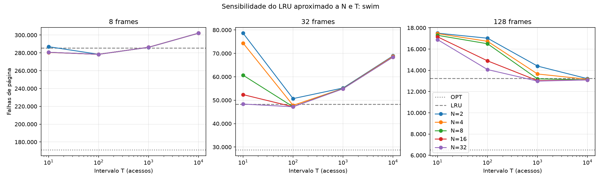
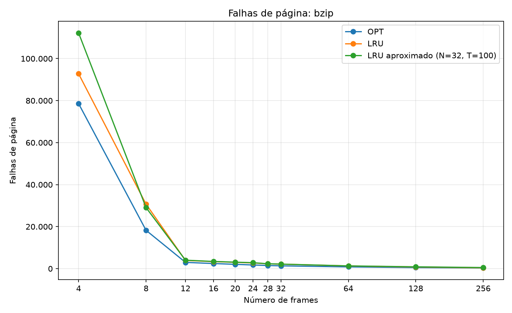
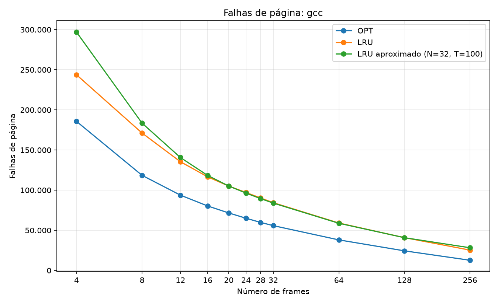
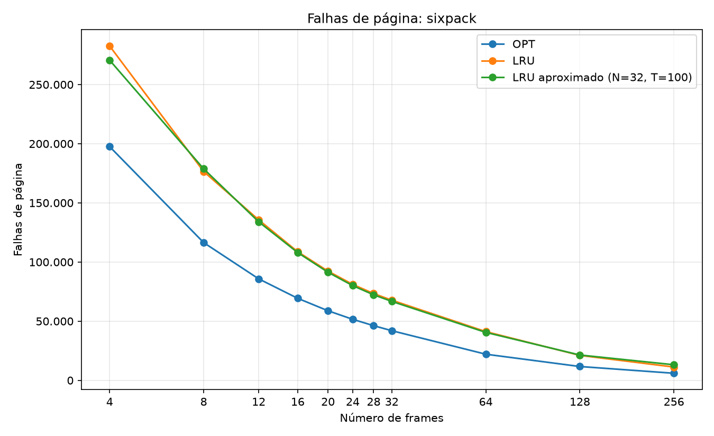
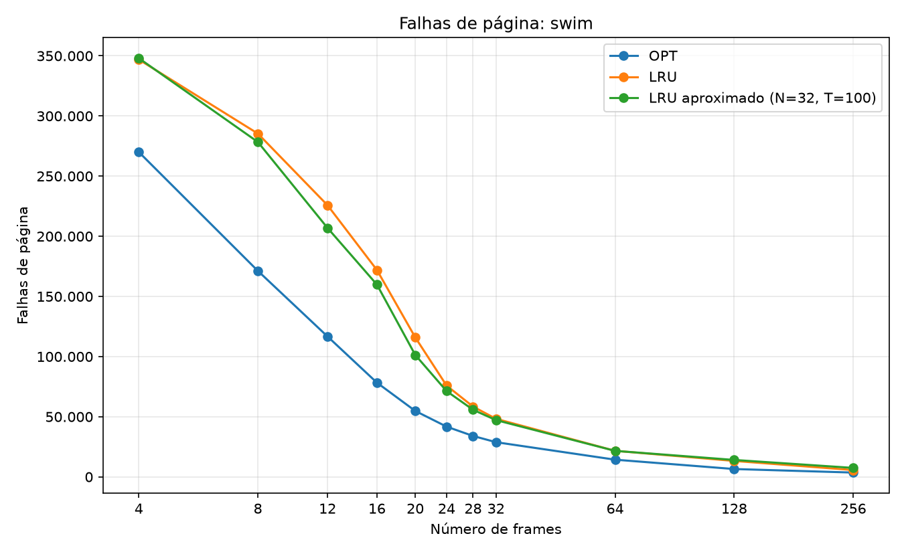
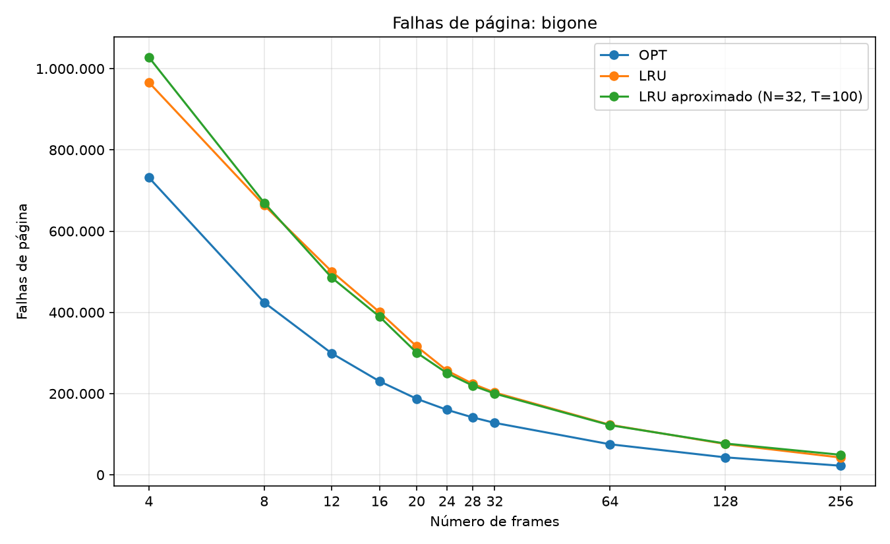

# Simulação de algoritmos de substituição de páginas

Trabalho 2 da disciplina de Sistemas Operacionais. O objetivo é avaliar o impacto da política de substituição de páginas no número de falhas de página, usando traces reais de acesso à memória e diferentes quantidades de frames.

O simulador compara três políticas:

- **OPT** (ótimo de Belady), que serve como limite inferior;
- **LRU exato**, a política que o LRU aproximado tenta imitar;
- **LRU aproximado** com bit de referência e N bits adicionais de histórico (algoritmo de *aging*), com N e o intervalo de deslocamento configuráveis.

## Sumário

- [Estrutura do projeto](#estrutura-do-projeto)
- [Modelo de simulação](#modelo-de-simulação)
- [Algoritmos](#algoritmos)
- [Instalação](#instalação)
- [Uso](#uso)
- [Testes](#testes)
- [Resultados](#resultados)
- [Conclusões](#conclusões)

## Estrutura do projeto

```
simulacao-algoritmos-so/
├── src/
│   ├── leitor_trace.py   # leitura do trace e conversão de endereço em número de página
│   ├── algoritmos.py     # OPT, LRU exato e LRU aproximado
│   ├── main.py           # simulador: executa os algoritmos e grava o CSV
│   └── graficos.py       # gera os gráficos a partir do CSV
├── tests/
│   └── test_algoritmos.py
├── resultados/           # CSVs, logs de execução e gráficos (ver "Resultados")
├── traces/               # traces do moodle (não versionados, ver .gitignore)
├── pytest.ini
└── requirements.txt
```

## Modelo de simulação

### Do trace ao número da página

Cada linha do trace tem o formato `31348900 W`: um endereço virtual de 32 bits em hexadecimal e o tipo de acesso (`R` para leitura, `W` para escrita). Com páginas de 4096 bytes (2¹²), os 12 bits inferiores do endereço são o deslocamento dentro da página e os 20 bits superiores são o número da página:

```
0x31348900 >> 12 = 0x31348
```

O deslocamento e o tipo de acesso não alteram o número de falhas de página, então o simulador guarda apenas a sequência de números de página.

### Memória

- A memória tem F frames, todos vazios no início.
- Para cada acesso, se a página já está em algum frame há um acerto; senão, há uma **falha de página**.
- Na falha, se existe frame livre a página é carregada nele; caso contrário, a política escolhe uma página vítima para sair.
- Todas as falhas são contadas, inclusive as **compulsórias** (o primeiro acesso a cada página), que nenhuma política consegue evitar. Por isso, o número de páginas distintas de um trace é o mínimo de falhas possível.

## Algoritmos

### OPT (ótimo de Belady)

Na falha, expulsa a página cujo próximo uso está mais distante no futuro, ou que nunca mais será usada. Nenhuma política consegue menos falhas para a mesma sequência, por isso ele serve de referência. Não é implementável num sistema operacional real (exige conhecer o futuro), mas é possível na simulação porque o trace inteiro é conhecido.

Para ser eficiente com traces de milhões de acessos, a implementação:

1. percorre o trace de trás para frente uma vez, calculando para cada acesso a posição do próximo acesso à mesma página;
2. mantém as páginas em memória num *max-heap* ordenado pelo próximo uso, com remoção preguiçosa das entradas desatualizadas.

Assim a vítima é encontrada em O(log n), sem varrer o trace a cada falha.

### LRU exato

Na falha, expulsa a página que está há mais tempo sem ser usada, apostando na localidade temporal: o passado recente prevê o futuro próximo. A implementação usa um `OrderedDict` com as páginas da menos para a mais recentemente usada. Em hardware real, manter essa ordem a cada acesso é caro demais, o que motiva as aproximações.

### LRU aproximado (bits de referência adicionais, ou *aging*)

Cada página em memória tem:

- um **bit de referência R**, que o hardware coloca em 1 a cada acesso à página;
- um **registrador de histórico de N bits**, mantido pelo sistema operacional.

A cada **T acessos** (o "tique do relógio"), para todas as páginas em memória:

```
historico = (R << (N - 1)) | (historico >> 1)
R = 0
```

O histórico registra se a página foi usada em cada um dos últimos N intervalos, com os intervalos mais recentes nos bits de maior peso. Quanto menor o valor, há mais tempo a página não é usada.

Decisões de implementação:

- **Escolha da vítima**: sai a página com menor valor de (R, histórico). O bit R é comparado primeiro porque indica uso desde o último deslocamento, informação mais recente que qualquer bit do histórico.
- **Desempate**: entre páginas com o mesmo (R, histórico), sai a carregada há mais tempo (critério FIFO).
- **Página recém-carregada**: entra com R = 1 e histórico zerado.
- **Valores escolhidos**: **N = 32 bits** e **T = 100 acessos**, definidos a partir da análise de sensibilidade descrita em [Escolha de N e T](#escolha-de-n-e-t). Ambos podem ser alterados por parâmetro.

O produto N × T é a "memória" do algoritmo: o histórico cobre os últimos N × T acessos (3200 com os valores escolhidos). Páginas sem uso nessa janela ficam com histórico zerado e empatam entre si.

## Instalação

Requer Python 3.9 ou superior.

```
pip install -r requirements.txt
```

Os traces do moodle devem ser colocados na pasta `traces/`. Eles não são versionados por serem grandes (cerca de 88 MB no total).

## Uso

### Simulação

```
python src/main.py traces/*.trace.txt
```

O programa mostra uma tabela no terminal com as falhas, a taxa de falhas e o tempo de cada execução, e grava os resultados em CSV.

| Opção | Descrição | Padrão |
|---|---|---|
| `--frames` | quantidades de frames avaliadas | 4 8 12 16 20 24 28 32 64 128 256 |
| `--bits` | bits de histórico (N) do LRU aproximado | 32 |
| `--intervalo` | acessos entre deslocamentos (T) do LRU aproximado | 100 |
| `--saida` | arquivo CSV de saída | `resultados/resultados.csv` |

`--bits` e `--intervalo` aceitam vários valores: o LRU aproximado é executado para cada combinação, enquanto OPT e LRU são executados uma vez por quantidade de frames. A análise de sensibilidade deste trabalho foi gerada com:

```
python src/main.py traces/*.trace.txt --frames 8 32 128 --bits 2 4 8 16 32 --intervalo 10 100 1000 10000 --saida resultados/sensibilidade.csv
```

### Formato do CSV

| Coluna | Conteúdo |
|---|---|
| `trace` | nome do arquivo de trace |
| `algoritmo` | `OPT`, `LRU` ou `LRU aproximado` |
| `frames` | quantidade de frames |
| `bits` | N (vazio para OPT e LRU) |
| `intervalo` | T (vazio para OPT e LRU) |
| `acessos` | total de acessos do trace |
| `falhas` | número de falhas de página |
| `taxa_falhas` | falhas / acessos |

### Gráficos

```
python src/graficos.py resultados/resultados.csv
python src/graficos.py resultados/sensibilidade.csv --sensibilidade
```

O primeiro comando gera `resultados/<trace>.png` (falhas por número de frames). O segundo gera `resultados/<trace>_sensibilidade.png` (falhas do LRU aproximado em função de T, uma linha por N e um painel por quantidade de frames, com OPT e LRU como referência).

## Testes

```
python -m pytest
```

Os testes verificam:

- a sequência de referência clássica do Silberschatz (`7 0 1 2 0 3 0 4 2 3 0 3 2 1 2 0 1 7 0 1`), que com 3 frames deve dar **9 falhas no OPT e 12 no LRU**;
- que o LRU aproximado com T = 1 e bits suficientes se comporta exatamente como o LRU;
- que o OPT nunca tem mais falhas que os outros algoritmos;
- que, com memória suficiente para todas as páginas, só ocorrem as falhas compulsórias;
- que, com um único frame, toda troca de página é uma falha;
- a conversão de endereço em número de página e a leitura do trace.

## Resultados

### Traces

| Trace | Acessos | Páginas distintas |
|---|---:|---:|
| bzip | 1.000.000 | 317 |
| gcc | 1.000.000 | 2.852 |
| sixpack | 1.000.000 | 3.890 |
| swim | 1.000.000 | 2.543 |
| bigone | 4.000.000 | 8.254 |

### Escolha de N e T

O LRU aproximado foi executado com N ∈ {2, 4, 8, 16, 32} e T ∈ {10, 100, 1000, 10000}, para 8, 32 e 128 frames, em todos os traces (`resultados/sensibilidade.csv`). Para cada combinação, a tabela mostra quanto o LRU aproximado ficou acima do LRU exato, em média geométrica sobre os 5 traces e as 3 quantidades de frames (valores negativos indicam menos falhas que o LRU exato):

| N \ T | 10 | 100 | 1000 | 10000 |
|---:|---:|---:|---:|---:|
| 2 | +19,3% | +9,8% | +8,6% | +13,8% |
| 4 | +16,7% | +7,5% | +6,6% | +13,2% |
| 8 | +12,4% | +5,3% | +5,9% | +12,6% |
| 16 | +8,8% | +2,8% | +5,6% | +12,6% |
| 32 | +7,0% | **+1,1%** | +5,4% | +12,6% |

Detalhando por quantidade de frames as melhores combinações:

| N | T | 8 frames | 32 frames | 128 frames |
|---:|---:|---:|---:|---:|
| 32 | 100 | +0,2% | −0,9% | +4,0% |
| 16 | 100 | +0,3% | −0,7% | +9,0% |
| 8 | 100 | +0,3% | +0,1% | +16,3% |
| 32 | 1000 | +10,3% | +6,9% | −0,8% |

O que os dados mostram:

- **T grande demais** (10000) é ruim em todos os casos: num intervalo tão longo quase todas as páginas em memória acabam com R = 1, e a escolha da vítima perde a noção de ordem, degenerando para FIFO. Aumentar N não ajuda, porque o problema está dentro do intervalo.
- **T pequeno demais** (10) com poucos bits faz a janela N × T ser curta: muitas páginas ficam com histórico zerado e empatadas. Mais bits compensam em parte.
- **Mais bits nunca pioram**, e ajudam justamente quando a janela N × T é curta em relação ao tempo que uma página fica sem uso, o que acontece com muitos frames.
- **N = 32 e T = 100** teve o melhor resultado geral, ficando a 1,1% do LRU exato. Além disso, 32 bits cabem numa palavra de máquina de uma arquitetura de 32 bits, o que torna a escolha realista. Esses são os valores padrão do simulador.

Gráficos: [bzip](resultados/bzip_sensibilidade.png), [gcc](resultados/gcc_sensibilidade.png), [sixpack](resultados/sixpack_sensibilidade.png), [swim](resultados/swim_sensibilidade.png), [bigone](resultados/bigone_sensibilidade.png).



### Falhas de página por número de frames

Resultados com N = 32 e T = 100 (`resultados/resultados.csv`). A última coluna compara o LRU aproximado com o LRU exato.

#### bzip



| Frames | OPT | LRU | LRU aproximado | Aprox. vs LRU |
|---:|---:|---:|---:|---:|
| 4 | 78.562 | 92.770 | 112.196 | +20,9% |
| 8 | 18.251 | 30.691 | 29.057 | −5,3% |
| 12 | 2.978 | 3.907 | 4.015 | +2,8% |
| 16 | 2.427 | 3.344 | 3.417 | +2,2% |
| 20 | 2.043 | 3.001 | 3.073 | +2,4% |
| 24 | 1.735 | 2.702 | 2.822 | +4,4% |
| 28 | 1.488 | 2.301 | 2.323 | +1,0% |
| 32 | 1.330 | 2.133 | 2.156 | +1,1% |
| 64 | 821 | 1.264 | 1.301 | +2,9% |
| 128 | 497 | 771 | 859 | +11,4% |
| 256 | 317 | 397 | 508 | +28,0% |

#### gcc



| Frames | OPT | LRU | LRU aproximado | Aprox. vs LRU |
|---:|---:|---:|---:|---:|
| 4 | 185.754 | 243.809 | 297.010 | +21,8% |
| 8 | 118.480 | 171.186 | 183.513 | +7,2% |
| 12 | 93.781 | 135.421 | 140.662 | +3,9% |
| 16 | 80.307 | 116.604 | 118.344 | +1,5% |
| 20 | 71.602 | 105.097 | 105.139 | +0,0% |
| 24 | 65.013 | 97.076 | 96.344 | −0,8% |
| 28 | 59.807 | 90.243 | 89.465 | −0,9% |
| 32 | 55.802 | 84.401 | 83.901 | −0,6% |
| 64 | 38.050 | 59.089 | 58.772 | −0,5% |
| 128 | 24.391 | 40.821 | 40.793 | −0,1% |
| 256 | 12.667 | 25.308 | 28.241 | +11,6% |

#### sixpack



| Frames | OPT | LRU | LRU aproximado | Aprox. vs LRU |
|---:|---:|---:|---:|---:|
| 4 | 197.551 | 282.620 | 270.605 | −4,3% |
| 8 | 116.407 | 176.496 | 178.765 | +1,3% |
| 12 | 85.779 | 135.644 | 134.006 | −1,2% |
| 16 | 69.325 | 108.682 | 107.971 | −0,7% |
| 20 | 58.809 | 92.319 | 91.375 | −1,0% |
| 24 | 51.576 | 81.089 | 80.053 | −1,3% |
| 28 | 46.203 | 73.341 | 72.297 | −1,4% |
| 32 | 41.955 | 67.747 | 66.744 | −1,5% |
| 64 | 22.083 | 41.186 | 40.529 | −1,6% |
| 128 | 11.690 | 21.090 | 21.404 | +1,5% |
| 256 | 5.981 | 11.240 | 13.169 | +17,2% |

#### swim



| Frames | OPT | LRU | LRU aproximado | Aprox. vs LRU |
|---:|---:|---:|---:|---:|
| 4 | 270.046 | 346.936 | 348.046 | +0,3% |
| 8 | 171.244 | 285.375 | 278.376 | −2,5% |
| 12 | 116.727 | 225.819 | 206.940 | −8,4% |
| 16 | 78.312 | 171.961 | 159.820 | −7,1% |
| 20 | 54.799 | 115.939 | 101.339 | −12,6% |
| 24 | 41.751 | 75.882 | 71.312 | −6,0% |
| 28 | 34.002 | 58.425 | 55.755 | −4,6% |
| 32 | 28.826 | 48.254 | 47.195 | −2,2% |
| 64 | 14.289 | 21.656 | 21.617 | −0,2% |
| 128 | 6.518 | 13.250 | 14.068 | +6,2% |
| 256 | 3.572 | 5.673 | 7.438 | +31,1% |

#### bigone



| Frames | OPT | LRU | LRU aproximado | Aprox. vs LRU |
|---:|---:|---:|---:|---:|
| 4 | 731.913 | 966.135 | 1.027.857 | +6,4% |
| 8 | 424.381 | 663.748 | 669.711 | +0,9% |
| 12 | 299.264 | 500.791 | 485.623 | −3,0% |
| 16 | 230.369 | 400.591 | 389.552 | −2,8% |
| 20 | 187.250 | 316.355 | 300.925 | −4,9% |
| 24 | 160.072 | 256.748 | 250.530 | −2,4% |
| 28 | 141.497 | 224.309 | 219.839 | −2,0% |
| 32 | 127.910 | 202.533 | 199.994 | −1,3% |
| 64 | 75.228 | 123.192 | 122.216 | −0,8% |
| 128 | 43.058 | 75.925 | 77.118 | +1,6% |
| 256 | 22.434 | 42.600 | 49.332 | +15,8% |

## Conclusões

- **Mais frames, menos falhas.** Em todos os traces e algoritmos o número de falhas cai à medida que os frames aumentam. Não houve anomalia de Belady: OPT e LRU são algoritmos de pilha, imunes a ela, e o LRU aproximado (que não tem essa garantia) também não a apresentou nos valores testados.
- **O OPT é sempre o melhor**, e a distância para os demais mostra quanto ainda poderia ser ganho com conhecimento do futuro. O LRU teve entre 18% e 120% mais falhas que o OPT, na maior parte dos casos entre 40% e 90%; a maior diferença foi no swim com 16 frames (120%).
- **A localidade de cada programa muda o formato da curva.** O bzip tem localidade muito forte: as falhas despencam entre 8 e 12 frames e depois a curva fica quase plana, ou seja, o conjunto de trabalho dele cabe em cerca de 12 frames. Com 256 frames, o OPT chega a 317 falhas, exatamente o número de páginas distintas (só falhas compulsórias). Os demais traces têm conjuntos de trabalho maiores e quedas mais graduais.
- **O LRU aproximado chega muito perto do LRU exato** na faixa intermediária (8 a 128 frames), e em vários casos tem até menos falhas (sixpack, swim e bigone). Isso acontece porque o histórico registra também a frequência de uso nos últimos intervalos, não só o último acesso, e o LRU exato não é ótimo.
- **O LRU aproximado perde nas pontas.** Com 4 frames, quase todas as páginas em memória são acessadas dentro de um mesmo intervalo de 100 acessos, ficam com R = 1 e a escolha vira praticamente FIFO. Com 256 frames, muitas páginas ficam sem uso por mais que a janela de 3200 acessos, o histórico zera e elas empatam. Nos dois casos falta informação para distinguir as páginas.
- **N e T precisam ser escolhidos juntos.** T controla a resolução temporal e N × T a duração da memória do algoritmo. Os dados indicam que T na ordem de 100 acessos e o maior N viável (32) dão o melhor equilíbrio.

## Reproduzindo os resultados

```
pip install -r requirements.txt
python src/main.py traces/*.trace.txt
python src/main.py traces/*.trace.txt --frames 8 32 128 --bits 2 4 8 16 32 --intervalo 10 100 1000 10000 --saida resultados/sensibilidade.csv
python src/graficos.py resultados/resultados.csv
python src/graficos.py resultados/sensibilidade.csv --sensibilidade
```

Os logs completos das execuções, com o tempo de cada simulação, estão em `resultados/execucao.log` e `resultados/sensibilidade.log`.
